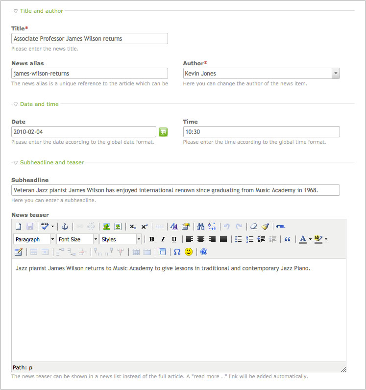

## Palettes

A palette is a group of form fields which are required to edit a record. A
palette typically does not include all columns of a table but only the ones that
belong to a particular module or content element. Palettes can change
dynamically depending on the user's permissions or type of element and certain
subparts of the form (called subpalettes) can be loaded interactively via Ajax.


### Defining groups

A palette is a string of field names which are concatenated with either a
semicolon (;) or a comma (,). Whereas the comma is just used to separate the
field names, the semicolon indicates the beginning of a new fieldset, which can
be expanded and collapsed.



The above example is defined by the following code:

```php
{title_legend},headline,alias,author;{date_legend},date,time;{teaser_legend:hide},subheadline,teaser
```

The `title_legend` and `date_legend` placeholders will be replaced with the
corresponding labels from the "TL_LANG" array.

```php
$GLOBALS['TL_LANG']['tl_news']['title_legend'] = 'Title and author';
$GLOBALS['TL_LANG']['tl_news']['date_legend']  = 'Date and time';
```


### Arranging fields

The Contao back end uses a simple two-column grid system to arrange input fields
within their groups. You can apply the following CSS classes in the evaluation
section of the Data Container Array as `tl_class` (e.g. `'tl_class'=>'w50
wizard'`).

<table>
<tr>
  <th>tl_class</th>
  <th>Description</th>
</tr>
<tr>
  <td>w50</td>
  <td>Set the field width to 50% and float it (<code>float:left</code>).</td>
</tr>
<tr>
  <td>clr</td>
  <td>Clear all floats (<code>clear:both</code>).</td>
</tr>
<tr>
  <td>wizard</td>
  <td>Shorten the input field so there is enough room for the wizard button
      (e.g. date picker fields).</td>
</tr>
<tr>
  <td>long</td>
  <td>Make the text input field span two columns.</td>
</tr>
<tr>
  <td>m12</td>
  <td>Add a 12 pixels top margin to the element (used for single
      checkboxes).</td>
</tr>
</table>
