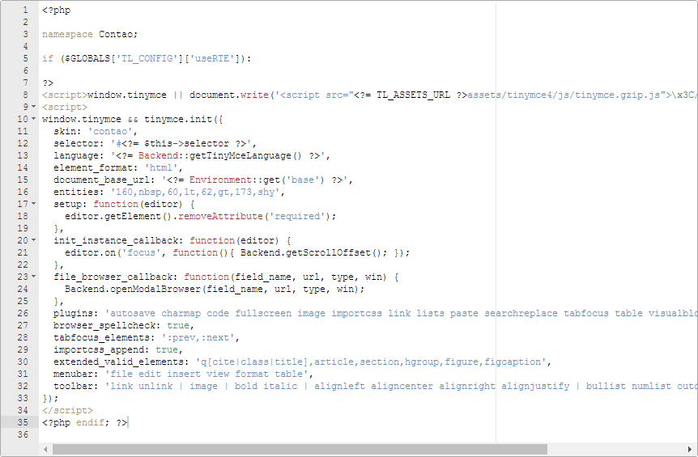
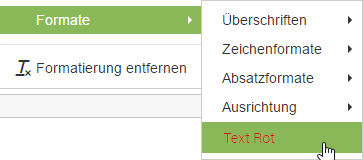
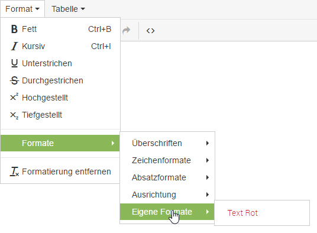

## Customizing TinyMCE

This page explains how to customize the Rich Text Editor and save the changes so
they will not be overridden on the next Contao update. Note that Contao does not
include all TinyMCE plugins by default, so if you want to use a certain plugin
that is not part of the Contao distribution, download it from the [TinyMCE
project website][1] and move it into the `assets/tinymce/plugins` folder.


The image above shows the default Rich Text Editor configuration file
`system/config/tinyMCE.php`. To create a custom configuration file, simply copy
it and rename it e.g. to `tinyCustom.php`. Then apply your changes and save the
new file. The last step is to adjust the [data container configuration][2] in
the `system/config/dcaconfig.php` file and tell Contao to which fields the
custom file shall be applied.

```php
// Use the custom RTE configuration for text elements
$GLOBALS['TL_DCA']['tl_content']['fields']['text']['eval']['rte'] =
'tinyCustom';
```

**Tag** The text below concerns the version 4.0.0 and higher.



The image shows the default configuration of the editor in the Contao default `be_tinyMCE.html5` Template.
To create a custom configuration, duplicate the template, add your changes and save the template as `be_tinyMCE.html5` in the template root dir. It will not work when placed inside subfolders like `/template/mytemplates/`.

### Custom Formats

This is how you can add custom formats to TinyMCE:

```js
// Define a color:
  style_formats_merge: true,
  style_formats: [
    { title: 'Text Red', inline: 'span', styles: { 'color': '#d11216' }, classes: 'text-red' },
  ]
```

Important is the line `style_formats_merge: true`.
This allows adding own formates without overwrighting the default formats that already exist.



To clean up Custom formats, you can group them inside your own format folder like this:

```js
  style_formats_merge: true,
  style_formats: [
  	{title: 'My Formats', items: [
  		{ title: 'Text Red', inline: 'span', styles: { 'color': '#d11216'}, classes: 'text-red' },
  	]}
  ]
```



Other informations on how to customize your TinyMCE can be found in the official [TinyMCE Documentation][3].


[1]: https://www.tinymce.com/
[2]: https://www.tinymce.com/docs/configure/
[3]: custom-configurations.md#customizing-the-data-container-configuration
