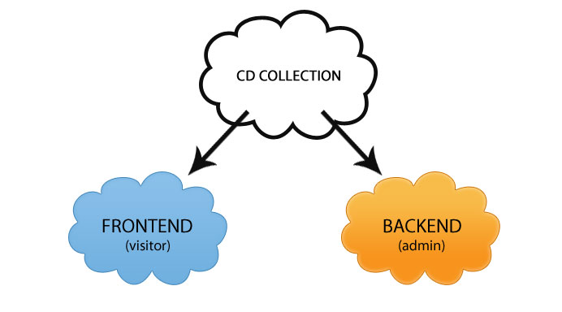
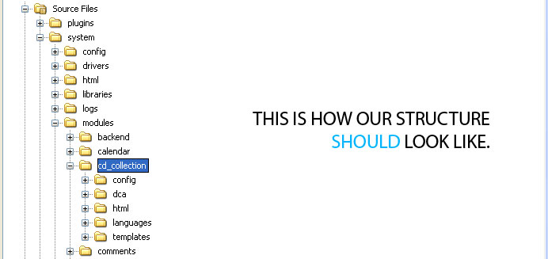
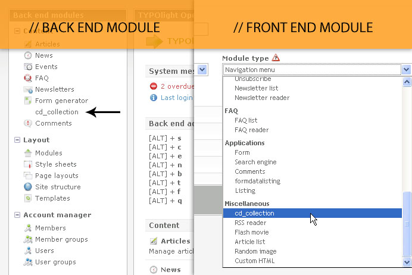

#Create a custom Contao module – part one  
  
> **Danger** This guite was written for Contao 2.x and a lot of it's information is outdated!  
 Read with care and only use as a general-purpose guide.
  
  


In this tutorial we’re going to build an own Contao custom module from scratch. This tutorial is perfect for getting used to basic development in Contao. Our module will be called CD Collection and will be presenting our CD collection divided into categories on the website. 

First of all, you need to know that Contao is divided into back end (administration area) and front end (website seen by visitors). Our module will present a collection on the website (that is the front end part), but it also needs a management section (back end part):





## File structure


Each module in Contao should be well organized and have the following structure:

The main folder of the module. Besides subfolders, it also contains the main php files of the module.


**/cd_collection/config**
Folder that contains `config.php` and usually `database.sql`. The config file tells Contao how to serve a module, while the database file contains a SQL query to create a new tables or alter existing ones.

**/cd_collection/dca**
Data Container Array folder, as we can read on the official [manual](https://contao.org/en/manual/2.11/data-container-arrays.html), is an array structure that defines to Contao Back end Class, how to display the data obtained from the DataContainer library (see below) to the user. The DCA has parameters to control the config, listing, operations, edit palettes (and sub-palettes), fields and their evaluation and formatting.

**/cd_collection/html**
This folder is optional and doesn’t need to be included. Its general purpose is to be a placeholder for miscellaneous other files, such as graphics, styles, scripts etc. It is often used to hold the module icon used in back end.

**/cd_collection/languages**
Place where all of the texts and labels are kept. While developing a module, we will not put the plain text into php files, but variables that will call a content of the language files. This increases flexibility, but is also necessary to make our module multilingual.

**/cd_collection/templates**
Each front end module is based upon templates. They are used to separate the code part from presentation part. Additionally, users will be able to create their own template files, adjusted for their needs.

Okay, let’s create the above file structure in `/system/modules/`





##Database & config

Now it’s time to prepare the database table and config file, which will tell Contao how to handle our module.

Enter the config folder and create `database.sql` file and fill it with:


```sql
--
-- Table `tl_cds_category`
--

CREATE TABLE `tl_cds_category` (
  `id` int(10) unsigned NOT NULL auto_increment,
  `tstamp` int(10) unsigned NOT NULL default '0',
  `title` varchar(64) NOT NULL default '',
  `description` text NULL,
  PRIMARY KEY  (`id`)
) ENGINE=MyISAM DEFAULT CHARSET=utf8;

--
-- Table `tl_cds`
--

CREATE TABLE `tl_cds` (
  `id` int(10) unsigned NOT NULL auto_increment,
  `pid` int(10) unsigned NOT NULL default '0',
  `tstamp` int(10) unsigned NOT NULL default '0',
  `title` varchar(64) NOT NULL default '',
  `artist` varchar(64) NOT NULL default '',
  `image` varchar(64) NOT NULL default '',
  `comment` text NULL,
  PRIMARY KEY  (`id`),
  KEY `pid` (`pid`)
) ENGINE=MyISAM DEFAULT CHARSET=utf8;
```

I think the code is clear and doesn’t need any explanation. Note that fields `id` and `tstamp` are required by Contao.

Note: I have noticed that there must be two spaces after `PRIMARY KEY`. If there’s only one, Contao will try to drop index id and add primary key id, which can’t be executed because the id key already exists!

Our relationship between tables is very simple and called parent-child. The child table `tl\_cds` identifies its parent by pid field, which means “parent id”.


We don’t need to manually import this file via phpMyAdmin or shell. As you might noticed during Contao installation, it provides a kind of synchronization between database and files. Now, simply go to Contao install tool (www.website.com/contao/install.php) and update database tables.

When Contao is initalized, each module configuration file is loaded allowing you to overwrite existing settings. It’s worth to note that Contao loads modules by alphabetical order. For example, if we would like to override News methods, we need to create a folder Xyz, and NOT Abc.

In the same folder create a file named `config.php`:


```php
<?php

// Back end module
array_insert($GLOBALS['BE_MOD']['content'], 3, array
(
  'cd_collection' => array
  (
    'tables' => array('tl_cds_category', 'tl_cds'),
    'icon'   => 'system/modules/cd_collection/html/icon.gif'
  )
));

// Front end module
array_insert($GLOBALS['FE_MOD']['miscellaneous'], 0, array
(
  'cd_collection' => 'ModuleCdCollection'
));

?>
```

Ok, let’s see what we have done here. First, we have added a new back end module called `cd\_collection` to the content group. It uses two tables called `tl\_cds` and `tl\_cds\_category`. We also have defined the path to an icon that will be uploaded later. Then, we have added a new front end module called `cd_collection` to the miscellaneous group.

If you use the `array\_insert` function to add a new back end or front end module, you can define its exact position. In our example, we are using the function to make our module the first one within the group.

Let’s take a look how it affected the back end:





##Module icon

Now, the most pleasant part of our module development. Let’s put an icon into the `html/` folder (as we defined in the config), so it will be visible in the back end and please the eye :)

[Click to download icon.](assets/icon.gif)


##So far, so good
That’s all for now. We have set up the config and database tables, also we’ve made our module visible in the back end. In the next part of the tutorial I will show you how to create the ‘heart’ of our module – the DCA.


[Check out the part two of this tutorial!](part2.md)


