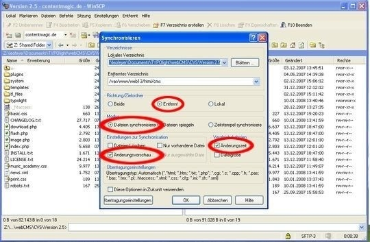

## Manuelles Update

Bei der manuellen Aktualisierung einer Contao-Installation können Sie entweder
das komplette Contao-Archiv auf den Server übertragen (Dateien ersetzen) oder
nur die geänderten Dateien hochladen (Dateien synchronisieren). In jedem Fall
sollten Sie vorher folgende Dateien und Ordner sichern - nur für den Fall, dass
ein Fehler auftritt oder Sie sie versehentlich überschreiben:

* `files/*`
* `system/config/dcaconfig.php`
* `system/config/initconfig.php`
* `system/config/langconfig.php`
* `system/config/localconfig.php`
* `templates/*`

Dieses Backup umfasst Ihre lokale Konfiguration, eventuell angepasste Templates
sowie die hochgeladenen Dateien.

### Dateien ersetzen

Die Dateien einer Contao-Installation zu ersetzen ist relativ simpel. Übertragen
Sie einfach das Contao-Archiv auf Ihren Server oder entpacken Sie es auf Ihrem
lokalen Rechner und kopieren Sie die Dateien anschließend mit einem FTP-Programm
(wir empfehlen [WinSCP][1]). Danach stellen Sie die Dateien aus dem Backup
wieder her und entfernen eventuelle Überbleibsel vorheriger Contao-Versionen.

> **Warning:** Wenn Sie Third-Party-Erweiterungen installiert haben, müssen Sie
diese ebenfalls sichern und nach dem Update wiederherstellen oder darauf achten,
sie gar nicht erst zu überschreiben. Andernfalls müssen diese Module neu
installiert werden, was bei einigen Erweiterungen zu Datenverlust führen kann!

### Dateien synchronisieren

Um eine Contao-Installation zu synchronisieren, können Sie entweder das [Unix
Diff-Programm][2] oder einen FTP-Client verwenden. Unix-Utilities werden
normalerweise nur von Serveradministratoren verwendet, daher werden sie hier
nicht erklärt. Um Dateien per FTP zu synchronisieren, öffnen Sie WinSCP und
verbinden Sie sich mit dem Server. Erstellen Sie ein Backup der oben genannten
Dateien und navigieren Sie dann zum Contao-Verzeichnis und klicken Sie auf die
"Dateien synchronisieren"-Schaltfläche.

Treffen Sie Ihre Auswahl wie in der Abbildung und wählen Sie unbedingt die
Option "Änderungsvorschau" aus, damit Sie die zu aktualisierenden Dateien noch
einmal prüfen können. Bestätigen Sie danach die Einstellungen im Vorschaufenster
und achten Sie besonders auf die zu löschenden Ressourcen! Klicken Sie "OK", um
den Synchronisationsvorgang zu starten.

### Die Datenbank aktualisieren

Nachdem Sie die Contao-Dateien aktualisiert haben, müssen Sie noch die Datenbank
auf den neuesten Stand bringen. Diese Arbeit übernimmt das Contao-Installtool
für Sie. Geben Sie Ihr Passwort ein, scrollen Sie bis zum Datenbank-Abschnitt
und bestätigen Sie die Änderungen.

### Den internen Cache leeren

Zum Schluss muss noch der interne Cache (DCA- und Sprachdateien) geleert und neu
angelegt werden. Gehen Sie im Backend zur "Systemwartung" und wählen unter
"Daten bereinigen" den Punkt "Internen Cache leeren" aus. Bestätigen Sie die
Aktion mit "Daten bereinigen".

Nun erscheint in der Kopfzeile vom Backend ein Hinweis, dass der interne Cache
noch nicht aufgebaut wurde. Erstellen Sie den internen Cache in dem Sie in der
Kopfzeile "Den Cache aufbauen" anklicken.

[1]: http://www.winscp.net
[2]: http://de.wikipedia.org/wiki/Diff
