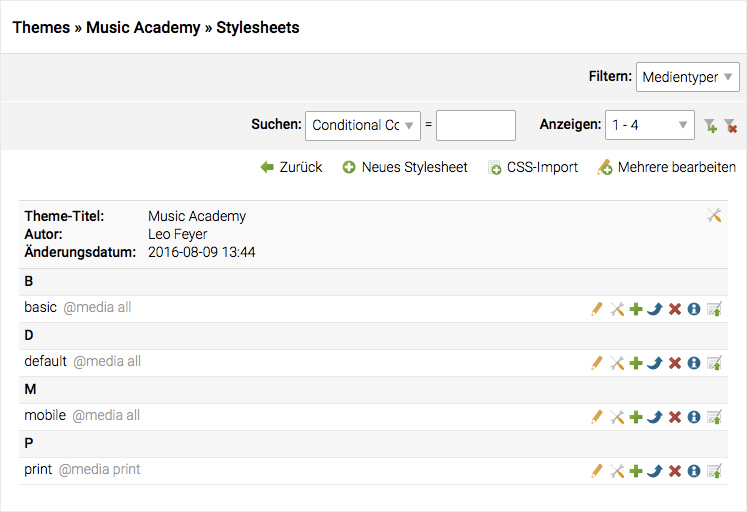
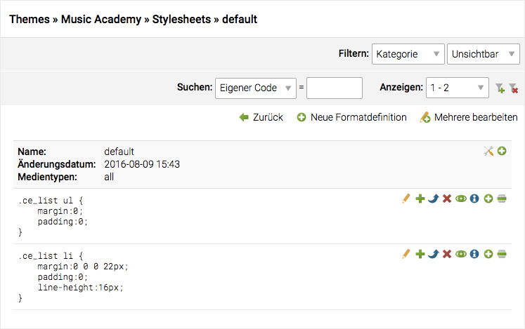
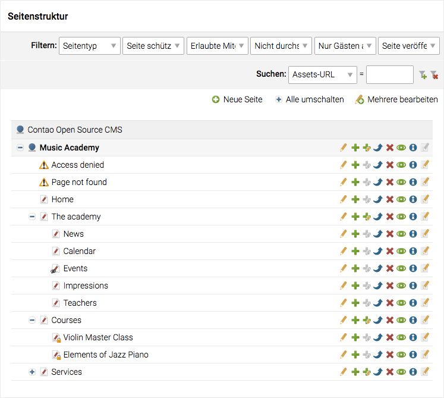
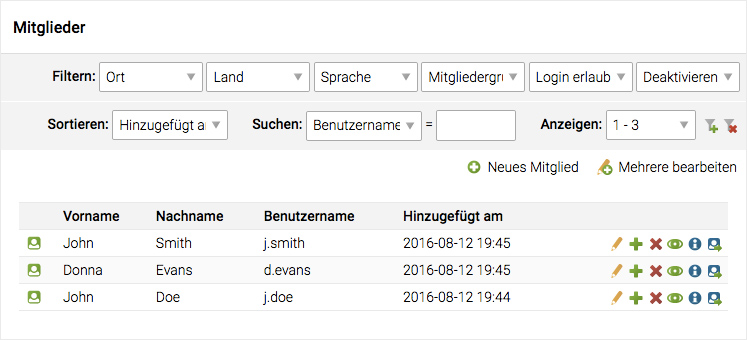

## Datensätze auflisten

Die Contao Core-Engine unterstützt drei Ansichten: eine einfache Liste ("list
view"), eine nach der übergeordneten Tabelle gruppierte Liste ("parent view")
und eine hierarchische Liste ("tree view"). Diese drei Ansichten werden zur
Darstellung der Daten im Backend verwendet.

### List View

Der "List View" listet die Datensätze einer Tabelle in einer bestimmten
Reihenfolge auf, normalerweise gruppiert nach Anfangsbuchstabe.

### Parent View

Der "Parent View" listet die Datensätze einer Kindtabelle auf, die sich auf
einen Datensatz der Elterntabelle beziehen. Eltern-Kind-Relationen kommen
häufig vor in Contao, z.B. bei Artikeln und Inhaltselementen, Archiven und
Nachrichten oder Stylesheets und Formatdefinitionen.

### Tree View

Der "Tree View" listet Datensätze auf, die in einer hierarchischen Struktur
organisiert sind. Contao unterstützt sowohl hierarchische Beziehungen innerhalb
einer Tabelle (z.B. Seitenstruktur) als auch Kindtabellen, die sich auf
hierarchische Elterntabellen beziehen (z.B. Artikel und Seiten).

### Daten sortieren und filtern

Contao bietet mehrere Möglichkeiten, Auflistungen zu sortieren und zu filtern,
damit Sie auch bei mehreren tausend Datensätzen den Überblick behalten. Viele
Listen können anhand eines oder mehrerer Felder eingeschränkt werden. Die
meisten bieten zusätzlich eine Volltext-Suche an, die sogar reguläre
Ausdrücke unterstützt. Um die Ladezeit zu optimieren, zeigt Contao immer nur
30 Datensätze auf einmal an.

