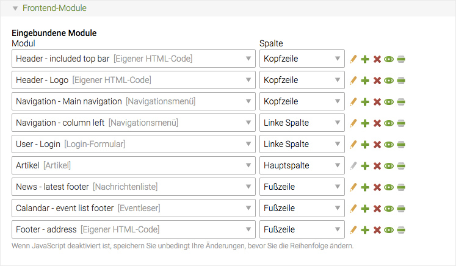

## Seitenlayouts

Seitenlayouts definieren den grundsätzlichen Aufbau einer Seite, wie z.B. die
Anzahl der Spalten oder die Gesamtbreite, und sie legen fest, welche
Frontend-Module in welcher Spalte angezeigt werden. Sie ermöglichen zudem das
Einbinden von Stylesheets und RSS- bzw. Atom-Feeds sowie das Einfügen einer
Google Analytics ID oder beliebigem JavaScript-Code, der für die Steuerung
interaktiver Elemente und Plugins benötigt wird. Das Contao CSS-Framework teilt
das Browserfenster automatisch in mehrere Layoutbereiche auf.

Das impliziert, dass Sie zum Zeitpunkt der Erstellung eines Seitenlayouts
bereits die benötigten Stylesheets und Frondend-Module angelegt haben müssen.
Daher wird folgende Reihenfolge beim Anlegen von Ressourcen empfohlen:

* Erstellen der benötigten Stylesheets
* Erstellen der benötigten Frontend-Module
* Optionale Erstellung von Nachrichtenarchiven oder Kalendern
* Erstellen eines neuen Seitenlayouts und Einbindung der Komponenten
