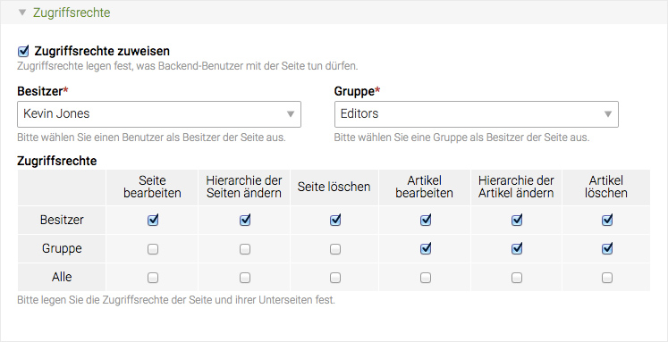

## Seitentypen

Der Typ einer Seite legt fest, ob sie statische Inhalte ausgibt, zu einer
anderen Seite weiterleitet oder den Startpunkt einer Webseite innerhalb der
Seitenstruktur markiert. Contao unterstützt folgende 6 Seitentypen:

<table>
<tr>
  <th>Seitentyp</th>
  <th>Beschreibung</th>
</tr>
<tr>
  <td>Reguläre Seite</td>
  <td>Eine reguläre Seite enthält Artikel und Inhaltselemente. Sie verhält
      sich wie eine statische HTML-Seite.</td>
</tr>
<tr>
  <td>Externe Weiterleitung</td>
  <td>Diese Seite leitet Besucher automatisch zu einer externen Webseite um
      (entspricht einem Hyperlink).</td>
</tr>
<tr>
  <td>Interne Weiterleitung</td>
  <td>Diese Seite leitet Besucher automatisch zu einer anderen Seite innerhalb
      der Seitenstruktur um.</td>
</tr>
<tr>
  <td>Startpunkt einer Webseite</td>
  <td>Diese Seite kennzeichnet den Startpunkt einer neuen Webseite innerhalb der
      Seitenstruktur.</td>
</tr>
<tr>
  <td>403 Zugriff verweigert</td>
  <td>Beim Aufruf einer geschützten Seite ohne Zugriffsrechte wird stattdessen
      die 403-Fehlerseite geladen. Diese Seite muss <b>direkt unterhalb</b>
      des Startpunktes einer Webseite angelegt werden.</td>
</tr>
<tr>
  <td>404 Seite nicht gefunden</td>
  <td>Beim Aufruf einer nicht vorhandenen Seite wird stattdessen die
      404-Fehlerseite geladen. Diese Seite muss <b>direkt unterhalb</b>
      des Startpunktes einer Webseite angelegt werden.</td>
</tr>
</table>

### Startseite

Wenn das Frontend mit einer leeren Request URL geöffnet wird (z.B. 
`http://www.example.org/`), zeigt Contao die erste veröffentlichte Seite im
jeweiligen Startpunkt. Der Alias dieser Seite sollte auf `index` gesetzt werden.
Nur dann wird die erzeugte URL für diese Seite auch ein leerer Request sein.

Ab Version `3.5.18` wird außerdem automatisch auf die Startseite weitergeleitet,
falls deren Alias nicht `index` lautet. Die URL inkludiert dann den Alias und das
global definierte Suffix (z.B. `http://www.example.org/home.html`).

### Multidomain-Betrieb

Contao unterstützt mehrere Webseiten innerhalb der Seitenstruktur und leitet
Besucher je nach DNS- und Spracheinstellungen automatisch auf einen bestimmten
Startpunkt einer Webseite weiter. Nehmen wir an, Sie betreiben eine
zweisprachige Firmenwebseite unter "www.example.com" und eine kleine private
Webseite unter der Domain "www.personal.example.org". Sie benötigen dafür drei
Startpunkte:

<table>
<tr>
  <th>Typ</th>
  <th>DNS</th>
  <th>Sprachenkürzel</th>
  <th>Fallback-Sprache</th>
</tr>
<tr>
  <td>Deutsche Firmenseite</td>
  <td>keine</td>
  <td>de</td>
  <td>nein</td>
</tr>
<tr>
  <td>Englische Firmenseite</td>
  <td>keine</td>
  <td>en</td>
  <td>ja</td>
</tr>
<tr>
  <td>Private Webseite</td>
  <td>www.personal.example.org</td>
  <td>de</td>
  <td>ja</td>
</tr>
</table>

Die folgende Tabelle zeigt, zu welcher Seite ein Besucher abhängig von der
Domain und seiner Browsersprache weitergeleitet wird.

<table>
<tr>
  <th>Domain</th>
  <th>Browsersprache</th>
  <th>Weiterleitung</th>
</tr>
<tr>
  <td>www.example.com</td>
  <td>Englisch</td>
  <td>Englische Firmenseite</td>
</tr>
<tr>
  <td>www.example.com</td>
  <td>Deutsch</td>
  <td>Deutsche Firmenseite</td>
</tr>
<tr>
  <td>www.example.com</td>
  <td>Spanisch</td>
  <td>Englische Firmenseite</td>
</tr>
<tr>
  <td>www.personal.example.org</td>
  <td>egal</td>
  <td>Persönliche Webseite</td>
</tr>
</table>

Beachten Sie, dass die persönliche Webseite ohne die Option "Sprachen-Fallback"
nur für deutsche Benutzer sichtbar wäre!

### Zugriffsrechte

Zugriffsrechte legen fest, was Backend-Benutzer mit einer Seite und ihren
Artikeln machen dürfen. Sie haben nichts mit dem Zugriffsschutz zu tun, der den
Zugriff auf eine Seite im Frontend limitiert! Ähnlich dem Unix-Rechtesystem
gibt es drei Zugriffsebenen:

* Zugriff als Besitzer einer Seite
* Zugriff als Mitglied der Gruppe einer Seite
* Zugriff als unprivilegierter Benutzer

Für jede Zugriffsebene können gesonderte Rechte vergeben werden.
Standardmäßig darf der Besitzer einer Seite sowohl die Seite selbst, als auch
die damit verbundenen Artikel bearbeiten. Ein Mitglied der Gruppe einer Seite
darf hingegen nur die Artikel bearbeiten und ein unprivilegierter Benutzer hat
überhaupt keine Schreibrechte.

