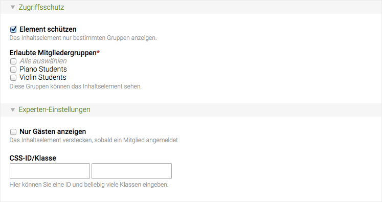

## Artikel

Artikel sind Container für Inhaltselemente. Das Gruppieren zusammengehöriger
Inhaltselemente macht es einfach, sie alle auf einmal zu verschieben, zu
veröffentlichen, zu kopieren oder zu exportieren, anstatt jedes einzelne
Element zu bearbeiten. Jeder Artikel ist mit einer bestimmten Seite und einem
Layoutbereich assoziiert und hat daher eine feste Position innerhalb der
Seitenstruktur und auf der Webseite.


### Inhaltselemente

Inhaltselemente sind ein einfacher und intuitiver Weg, um Inhalte zuerstellen.
Anstatt nur den Rich Text Editor zu verwenden, bietet Contao für jeden
Inhaltstyp wie z.B. Texte, Listen, Tabellen, Hyperlinks, Bilder oder Downloads
ein eigenes Element. Nachfolgend finden Sie eine Übersicht über die im
Contao-Core enthaltenen Inhaltselemente.

<table>
<tr>
  <th>Name</th>
  <th>CSS-Klasse</th>
  <th>Beschreibung</th>
</tr>
<tr>
  <td>Überschrift</td>
  <td>ce_headline</td>
  <td>Erzeugt eine Überschrift (h1 - h6).</td>
</tr>
<tr>
  <td>Text</td>
  <td>ce_text</td>
  <td>Erzeugt einen Rich Text, der mit <a href="http://www.tinymce.com">TinyMCE</a>
      formatiert werden kann.</td>
</tr>
<tr>
  <td>HTML</td>
  <td>-</td>
  <td>Erlaubt das Hinzufügen von eigenem HTML-Code.</td>
</tr>
<tr>
  <td>Aufzählung</td>
  <td>ce_list</td>
  <td>Erzeugt eine geordnete oder ungeordnete Liste.</td>
</tr>
<tr>
  <td>Tabelle</td>
  <td>ce_table</td>
  <td>Erzeugt eine optional sortierbare Tabelle.</td>
</tr>
<tr>
  <td>Code</td>
  <td>ce_code</td>
  <td>Gibt formatierten Programmcode auf dem Bildschirm aus.</td>
</tr>
<tr>
  <td>Markdown</td>
  <td>ce_markdown</td>
  <td>Erzeugt HTML-Code aus einem Markdown-Text.</td>
</tr>
<tr>
  <td>Akkordeon (Einzelelement)</td>
  <td>ce_accordionSingle</td>
  <td>Erzeugt ein einzelnes Akkordeon-Element (Mit <a href="http://mootools.net">MooTools</a>).</td>
</tr>
<tr>
  <td>Akkordeon (Umschlag Anfang)</td>
  <td>ce_accordionStart</td>
  <td>Erzeugt den öffnenden Teil des Akkordeon-Umschlags.</td>
</tr>
<tr>
  <td>Akkordeon (Umschlag Ende)</td>
  <td>-</td>
  <td>Erzeugt den schließenden Teil des Akkordeon-Umschlags.</td>
</tr>
<tr>
  <td>Content-Slider (Umschlag Anfang)</td>
  <td>ce_sliderStart</td>
  <td>Erzeugt den öffnenden Teil des Slider-Umschlags.</td>
</tr>
<tr>
  <td>Content-Slider (Umschlag Ende)</td>
  <td>-</td>
  <td>Erzeugt den schließenden Teil des Slider-Umschlags.</td>
</tr>
<tr>
  <td>Hyperlink</td>
  <td>ce_hyperlink</td>
  <td>Erzeugt einen Verweis auf eine andere Webseite.</td>
</tr>
<tr>
  <td>Top-Link</td>
  <td>ce_toplink</td>
  <td>Erzeugt einen Link zum Seitenanfang.</td>
</tr>
<tr>
  <td>Bild</td>
  <td>ce_image</td>
  <td>Erzeugt ein einzelnes Bild.</td>
</tr>
<tr>
  <td>Galerie</td>
  <td>ce_gallery</td>
  <td>Erzeugt eine Lightbox Bildergalerie.</td>
</tr>
<tr>
  <td>Video/Audio</td>
  <td>ce_player</td>
  <td>Erzeugt einen Video- bzw. Audio-Player.</td>
</tr>
<tr>
  <td>YouTube</td>
  <td>ce_youtube</td>
  <td>Fügt ein YouTube-Video ein.</td>
</tr>
<tr>
  <td>Vimeo</td>
  <td>ce_vimeo</td>
  <td>Fügt ein Vimeo-Video ein.</td>
</tr>
<tr>
  <td>Download</td>
  <td>ce_download</td>
  <td>Erzeugt einen Link zum Download einer Datei.</td>
</tr>
<tr>
  <td>Downloads</td>
  <td>ce_downloads</td>
  <td>Erzeugt mehrere Links zum Download von Dateien.</td>
</tr>
<tr>
  <td>Artikel</td>
  <td>-</td>
  <td>Fügt einen anderen Artikel ein.</td>
</tr>
<tr>
  <td>Inhaltselement</td>
  <td>(parent class)</td>
  <td>Fügt ein anderes Inhaltselement ein.</td>
</tr>
<tr>
  <td>Formular</td>
  <td>ce_form</td>
  <td>Fügt ein Formular ein.</td>
</tr>
<tr>
  <td>Modul</td>
  <td>(parent class)</td>
  <td>Fügt ein Frontend-Modul ein.</td>
</tr>
<tr>
  <td>Artikelteaser</td>
  <td>ce_teaser</td>
  <td>Zeigt den Teasertext eines Artikels an.</td>
</tr>
<tr>
  <td>Kommentare</td>
  <td>ce_comments</td>
  <td>Fügt ein Kommentar-Formular ein.</td>
</tr>
</table>


### Zugriffsschutz

Jedes Inhaltselement kann geschützt werden, so dass es nur Gäste oder Benutzer
einer bestimmten Mitgliedergruppe sehen können.




### Flash-Inhalte

Flash-Inhalte sind spezielle Inhalte, die nicht als Artikel auf der Webseite
ausgegeben, sondern mittels `loadVars()` in einen dynamischen Flash-Film geladen
werden. Fügen Sie folgendes Skript in Ihren Flash-Film ein, um die Kommunikation
mit Contao zu ermöglichen:

```as
TextField.prototype._loadArticle = function(flashID) {
  tf = this;

  // HTML-Mode aktivieren
  tf.html = true;
  tf.htmlText = "";

  // LoadVars-Objekt instantiieren
  lv = new LoadVars();
  lv["flashID"] = flashID;
  lv.sendAndLoad(URL + "flash.php", lv, "POST");

  lv.onLoad = function(success) {
    if (success) {
      tf.htmlText = lv["content"];
    }
  }
}

// Den Flash-Inhalt "myArticle" in das Textfeld "myTextBox" laden
myTextBox._loadArticle("myArticle");
```


#### Ein Stylesheet importieren

Das folgende ActionScript erlaubt das Importieren eines Stylesheets zur
Formatierung des Textfeldes:

```as
TextField.prototype._addCSS = function(style_sheet) {
  tf= this;
  tf.styleSheet = null;

  // StyleSheet-Objekt instantiieren
  st = new TextField.StyleSheet();
  st.load(URL + style_sheet);

  st.onLoad = function(success) {
    if (success) {
      tf.styleSheet = st;
    }
  }
}

// Das Stylesheet "basic.css" zum Textfeld "myTextBox" hinzufügen
myTextBox._addCSS("basic.css");
```

Beachten Sie, dass Flash nur einen kleinen Teil der HTML-Tags unterstützt und
manche Formatierungen daher nicht angezeigt werden können.
