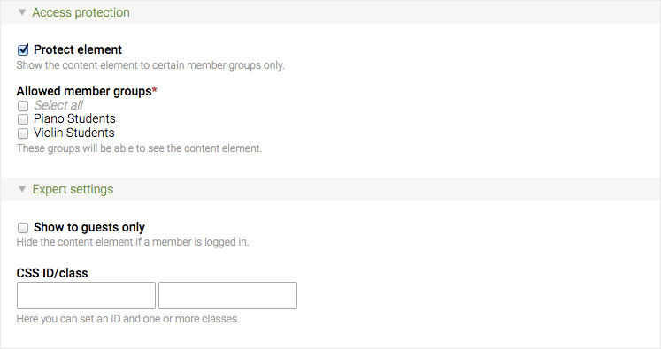

## Articles

Articles are containers for content elements. Grouping content elements that
belong together makes it easy to move, publish, copy, edit or export them all at
once instead of one by one. Each article is associated with a particular page
and layout section and therefore has a fixed position in the site structure and
on the website. Contao optionally shows only the article teaser with a "Read
more" link.


### Content elements

Content elements are an easy and intuitive way to create content. Instead of
just using a Rich Text Editor, Contao provides a separate element for each type
of content like texts, lists, tables, hyperlinks, images or downloads. Here is
an overview of the Contao core content elements:

<table>
<tr>
  <th>Name</th>
  <th>CSS class</th>
  <th>Description</th>
</tr>
<tr>
  <td>Headline</td>
  <td>ce_headline</td>
  <td>Generates a headline (h1 - h6).</td>
</tr>
<tr>
  <td>Text</td>
  <td>ce_text</td>
  <td>Generates a rich text that can be formatted using <a href="http://www.tinymce.com">TinyMCE</a>.</td>
</tr>
<tr>
  <td>HTML</td>
  <td>-</td>
  <td>Allows you to add custom HTML code.</td>
</tr>
<tr>
  <td>List</td>
  <td>ce_list</td>
  <td>Generates an ordered or unordered list.</td>
</tr>
<tr>
  <td>Table</td>
  <td>ce_table</td>
  <td>Generates an optionally sortable table.</td>
</tr>
<tr>
  <td>Code</td>
  <td>ce_code</td>
  <td>Highlights code snippets and prints them to the screen.</td>
</tr>
<tr>
  <td>Accordion (single element)</td>
  <td>ce_accordion</td>
  <td>Generates a single accordion element (with <a href="http://mootools.net">MooTools</a>).</td>
</tr>
<tr>
  <td>Accordion (wrapper start)</td>
  <td>ce_accordionStart</td>
  <td>Generates the opening part of the accordion wrapper.</td>
</tr>
<tr>
  <td>Accordion (wrapper stop)</td>
  <td>-</td>
  <td>Generates the closing part of the accordion wrapper.</td>
</tr>
<tr>
  <td>Content slider (wrapper start)</td>
  <td>ce_sliderStart</td>
  <td>Generates the opening part of the slider wrapper.</td>
</tr>
<tr>
  <td>Content slider (wrapper stop)</td>
  <td>-</td>
  <td>Generates the closing part of the slider wrapper.</td>
</tr>
<tr>
  <td>Hyperlink</td>
  <td>ce_hyperlink</td>
  <td>Generates a link to another website.</td>
</tr>
<tr>
  <td>Top link</td>
  <td>ce_toplink</td>
  <td>Generates a link to jump to the top of the page.</td>
</tr>
<tr>
  <td>Image</td>
  <td>ce_image</td>
  <td>Generates a stand-alone image.</td>
</tr>
<tr>
  <td>Gallery</td>
  <td>ce_gallery</td>
  <td>Generates a <a href="http://www.digitalia.be/software/slimbox">lightbox</a>
      image gallery.</td>
</tr>
<tr>
  <td>Video/audio</td>
  <td>ce_player</td>
  <td>Generates a video or audio player.</td>
</tr>
<tr>
  <td>YouTube</td>
  <td>ce_youtube</td>
  <td>Adds a YouTube video.</td>
</tr>
<tr>
  <td>Download</td>
  <td>ce_download</td>
  <td>Generates a link to download a file.</td>
</tr>
<tr>
  <td>Downloads</td>
  <td>ce_downloads</td>
  <td>Generates multiple links to download files.</td>
</tr>
<tr>
  <td>Article</td>
  <td>-</td>
  <td>Includes another article.</td>
</tr>
<tr>
  <td>Content element</td>
  <td>(parent class)</td>
  <td>Includes another content element.</td>
</tr>
<tr>
  <td>Form</td>
  <td>ce_form</td>
  <td>Includes a form.</td>
</tr>
<tr>
  <td>Module</td>
  <td>(parent class)</td>
  <td>Includes a front end module.</td>
</tr>
<tr>
  <td>Article teaser</td>
  <td>ce_teaser</td>
  <td>Displays the teaser text of an article.</td>
</tr>
<tr>
  <td>Comments</td>
  <td>ce_comments</td>
  <td>Adds a comment form to the page.</td>
</tr>
</table>


### Access control

Each content element can be protected so only guests or members of a particular
group can see it on the website.




### Flash content

Flash content is a special type of content which is not shown in an article on
the website but loaded into a dynamic Flash movie using "loadVars()". To allow
communication between Contao and Flash, you have to add the following function
to the root frame of your movie:

```as
TextField.prototype._loadArticle = function(flashID) {
  tf = this;

  // Enable HTML mode and remove content
  tf.html = true;
  tf.htmlText = "";

  // Instantiate a new LoadVars object
  lv = new LoadVars();
  lv["flashID"] = flashID;
  lv.sendAndLoad(URL + "flash.php", lv, "POST");

  lv.onLoad = function(success) {
    if (success) {
      tf.htmlText = lv["content"];
    }
  }
}

// Load the Flash content "myArticle" into the text field "myTextBox"
myTextBox._loadArticle("myArticle");
```


#### Importing a style sheet

The following ActionScript allows you to import a style sheet to format a
dynamic text field:

```as
TextField.prototype._addCSS = function(style_sheet) {
  tf= this;
  tf.styleSheet = null;

  // Instantiate a new StyleSheet object
  st = new TextField.StyleSheet();
  st.load(URL + style_sheet);

  st.onLoad = function(success) {
    if (success) {
      tf.styleSheet = st;
    }
  }
}

// Add the style sheet "basic.css" to the text box "myTextBox"
myTextBox._addCSS("basic.css");
```

Note that Flash only supports a small subset of HTML tags, so some of your
styles might not display correctly.
