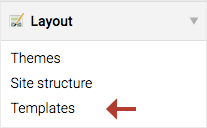

## Templates

A template is mainly composed of HTML and PHP code. It is used to structure a 
piece of content of a module or a content element, etc. For example, the 
template `news_full.html5` displays the full content of a news item whereas the 
template `news_short.html5` displays only a portion of this content.

The templates are located in their own modules. For example, `news_full.html5` 
is located under `system/modules/news/templates/news`.

If you edit this file directly in this folder, it will be overwritten the next 
time you will update Contao and **you will lose** all your changes. To avoid 
this, Contao allows you to modify the templates directly from the back end. In 
this case, the file is duplicated and your changes will be preserved during 
each update.

Create a new folder and add one or more templates you want to edit. Subsequently, 
do not forget to attach the folder to the theme as explained in the paragraph 
[Theme components][1].

A template can be a part of the structure of a module, a content element, a form, 
etc. and that is why they are prefixed. They can be easily grouped, ordered and 
recognized. For example: the prefix `j_` means "jQuery" and `nl_` means 
"newsletter".

[1]: ../03-managing-pages/themes.md#theme-components
