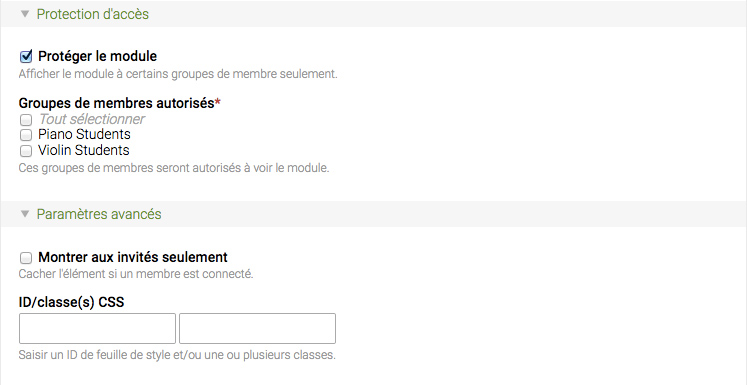

## Modules

Les modules front office vous permettent d'ajouter presque n'importe quel type
de fonctionnalités à votre site internet. Le cœur de Contao comprend des
modules pour générer différents menus de navigation, gérer l'enregistrement et
l'authentification d'un membre, rechercher sur le site, l'importation de flux
RSS et bien plus encore. Pour créer un module, connectez-vous au back office et
choisissez "Thèmes" -> "modules front office" dans le menu de navigation.

<table>
<tr>
  <th>Module</th>
  <th>Classe CSS</th>
  <th>Description</th>
</tr>
<tr>
  <td>Menu de navigation</td>
  <td>mod_navigation</td>
  <td>Génère un menu de navigation à partir de la structure de site.</td>
</tr>
<tr>
  <td>Navigation personnalisée</td>
  <td>mod_customnav</td>
  <td>Génère un menu personnalisé.</td>
</tr>
<tr>
  <td>Navigation "fil d'Ariane"</td>
  <td>mod_breadcrumb</td>
  <td>Génère un menu de type "fil d'Ariane".</td>
</tr>
<tr>
  <td>Navigation rapide</td>
  <td>mod_quicknav</td>
  <td>Génère un menu de type liste déroulante à partir de la structure de
  site.</td>
</tr>
<tr>
  <td>Lien rapide</td>
  <td>mod_quicklink</td>
  <td>Génère un menu de type liste déroulante.</td>
</tr>
<tr>
  <td>Navigation "Livre"</td>
  <td>mod_booknav</td>
  <td>Génère un menu de type "Livre".</td>
</tr>
<tr>
  <td>Pagination d'articles</td>
  <td>mod_article_nav</td>
  <td>Génère une pagination pour naviguer dans les articles.</td>
</tr>
<tr>
  <td>Plan du site</td>
  <td>mod_sitemap</td>
  <td>Génère une liste de toutes les pages de la structure de site.</td>
</tr>
<tr>
  <td>Formulaire de connexion</td>
  <td>mod_login</td>
  <td>Génère un formulaire de connexion.</td>
</tr>
<tr>
  <td>Déconnexion automatique</td>
  <td>-</td>
  <td>Déconnecte automatiquement un membre.</td>
</tr>
<tr>
  <td>Données personnelles</td>
  <td>mod_personalData</td>
  <td>Génère un formulaire permettant de modifier les données personnelles
  d'un membre.</td>
</tr>
<tr>
  <td>Formulaire d'inscription</td>
  <td>mod_registration</td>
  <td>Crée un formulaire d'inscription.</td>
</tr>
<tr>
  <td>Changer le mot de passe</td>
  <td>mod_changePassword</td>
  <td>Génère un formulaire pour changer le mot de passe.</td>
</tr>
<tr>
  <td>Mot de passe perdu</td>
  <td>mod_password</td>
  <td>Crée un formulaire de demande de nouveau mot de passe.</td>
</tr>
<tr>
  <td>Fermer le compte</td>
  <td>mod_closeAccount</td>
  <td>Crée un formulaire pour supprimer le compte d'un membre.</td>
</tr>
<tr>
  <td>Liste d'actualités</td>
  <td>mod_newslist</td>
  <td>Ajoute une liste d'actualités à la page.</td>
</tr>
<tr>
  <td>Lecteur d'actualités</td>
  <td>mod_newsreader</td>
  <td>Affiche les détails d'une actualité.</td>
</tr>
<tr>
  <td>Archive d'actualités</td>
  <td>mod_newsarchive</td>
  <td>Ajoute une archive d'actualités à la page.</td>
</tr>
<tr>
  <td>Menu archive d'actualités</td>
  <td>mod_newsmenu</td>
  <td>Génère un menu de navigation pour une archive d'actualités.</td>
</tr>
<tr>
  <td>Calendrier</td>
  <td>mod_calendar</td>
  <td>Ajoute un calendrier dans une page.</td>
</tr>
<tr>
  <td>Lecteur d'événement</td>
  <td>mod_eventreader</td>
  <td>Affiche les détails d'un événement.</td>
</tr>
<tr>
  <td>Liste d'événements</td>
  <td>mod_eventlist</td>
  <td>Ajoute une liste d'événements dans une page.</td>
</tr>
<tr>
  <td>Menu liste d'événements</td>
  <td>mod_eventmenu</td>
  <td>Génère un menu de navigation pour parcourir la liste d'événements.</td>
</tr>
<tr>
  <td>S'abonner</td>
  <td>mod_subscribe</td>
  <td>Génère un formulaire pour s'abonner à une ou plusieurs listes de
  diffusion.</td>
</tr>
<tr>
  <td>Se désabonner</td>
  <td>mod_unsubscribe</td>
  <td>Génère un formulaire pour se désabonner à une ou plusieurs listes de
  diffusion.</td>
</tr>
<tr>
  <td>Liste de bulletins d'information</td>
  <td>mod_nl_list</td>
  <td>Ajoute une liste de bulletins d'information à une page.</td>
</tr>
<tr>
  <td>Lecteur de bulletins d'information</td>
  <td>mod_nl_reader</td>
  <td>Affiche les détails d'un bulletin d'information.</td>
</tr>
<tr>
  <td>Liste de FAQ</td>
  <td>mod_faqlist</td>
  <td>Ajoute une liste de questions fréquemment posées dans la page.</td>
</tr>
<tr>
  <td>Lecteur de FAQ</td>
  <td>mod_faqreader</td>
  <td>Affiche la réponse à une question fréquemment posée.</td>
</tr>
<tr>
  <td>Page de FAQ</td>
  <td>mod_faqpage</td>
  <td>Afficher la liste de FAQ et le lecteur de FAQ sur la même page.</td>
</tr>
<tr>
  <td>Formulaire</td>
  <td>mod_form</td>
  <td>Ajoute un formulaire dans la page.</td>
</tr>
<tr>
  <td>Moteur de recherche</td>
  <td>mod_search</td>
  <td>Ajoute un formulaire de recherche dans la page.</td>
</tr>
<tr>
  <td>Commentaires</td>
  <td>mod_comments</td>
  <td>Gérer les commentaires ou les entrées d'un livre d'or.</td>
</tr>
<tr>
  <td>Liste d'enregistrements</td>
  <td>mod_listing</td>
  <td>Lister les enregistrements d'une table de la base de données.</td>
</tr>
<tr>
  <td>Animation Flash</td>
  <td>mod_flash</td>
  <td>Permet d'inclure une animation Flash dans une page.</td>
</tr>
<tr>
  <td>Liste d'articles</td>
  <td>mod_article_list</td>
  <td>Génère une liste d'articles contenu dans une zone particulière.</td>
</tr>
<tr>
  <td>Image aléatoire</td>
  <td>mod_random_image</td>
  <td>Ajoute une image aléatoire dans une page.</td>
</tr>
<tr>
  <td>Code HTML personnalisé</td>
  <td>-</td>
  <td>Permet d'inclure du code HTML personnalisé.</td>
</tr>
<tr>
  <td>Lecteur de flux RSS</td>
  <td>mod_rss_reader</td>
  <td>Ajoute un flux RSS à la page.</td>
</tr>
</table>

### Contrôle d'accès

Chaque module front office peut être protégé de sorte que seuls les invités ou
les membres d'un groupe en particulier puissent le voir sur le site internet.

